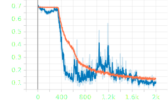
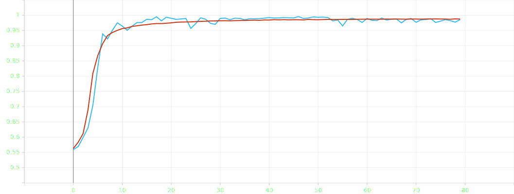
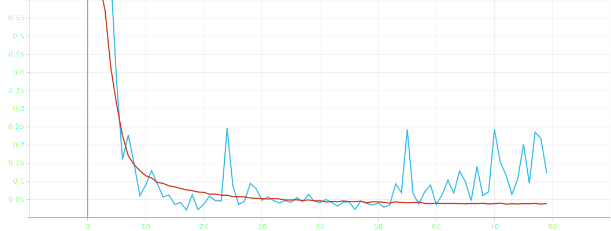

# Experiment v1
- Batch size: 32
- Epochs: 2000
- Data
    - Training set only containing 5 images for each captured parking event
    - Training set empty:  1667 
    - Training set occupied:  1666
    - Validation set empty:  874
    - Validation set occupied:  3152
- Model:
```python
# preprocessing layers 
Rescaling(1./255, input_shape=(width, height, 1)),
RandomRotation(0.2),
RandomZoom(0.2, 0.2),
# convolutional layers
Conv2D(32, (3, 3), activation='relu', padding='same', name='conv1'),
MaxPooling2D(pool_size=(2, 2), name='maxpool1'),
Conv2D(64, (3, 3), activation='relu', padding='same', name='conv2'),
MaxPooling2D(pool_size=(2, 2), name='maxpool2'),
Conv2D(128, (3, 3), activation='relu', padding='same', name='conv3'),
MaxPooling2D(pool_size=(2, 2), name='maxpool3'),
Flatten(name='flatten'),
Dense(128, activation='relu', name='dense1'),
Dropout(0.5, name='dropout'),
Dense(2, activation='softmax', name='output')
```

## Epoch accuracy


## Epoch loss


## Validation
Percentage of wrong predictions: 3.60%
Percentage of 'empty' predictions that were wrong: 16.36%
Percentage of 'occupied' predictions that were wrong: 0.06%

# Experiment v2
- Batch size: 32
- Epochs: 80 (degredation after 46)
- Data
    - Training set empty:  41834
    - Training set occupied:  46608
    - Validation set empty:  874
    - Validation set occupied:  3152
- Model:
```python
# preprocessing layers 
Rescaling(1./255, input_shape=(width, height, 1)),
RandomRotation(0.2),
RandomZoom(0.2, 0.2),
# convolutional layers
Conv2D(32, (3, 3), activation='relu', padding='same', name='conv1'),
MaxPooling2D(pool_size=(2, 2), name='maxpool1'),
Conv2D(64, (3, 3), activation='relu', padding='same', name='conv2'),
MaxPooling2D(pool_size=(2, 2), name='maxpool2'),
Conv2D(128, (3, 3), activation='relu', padding='same', name='conv3'),
MaxPooling2D(pool_size=(2, 2), name='maxpool3'),
Flatten(name='flatten'),
Dense(128, activation='relu', name='dense1'),
Dropout(0.5, name='dropout'),
Dense(2, activation='softmax', name='output')
```

## Epoch accuracy


## Epoch loss


## Validation
Percentage of wrong predictions: 0.89%
Percentage of 'empty' predictions that were wrong: 3.78%
Percentage of 'occupied' predictions that were wrong: 0.10%
